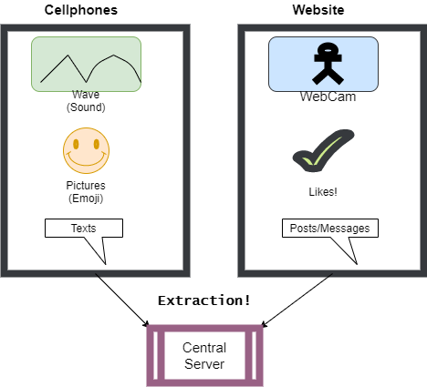

# Extract, Transform, and Load Processes

### Contents
1. [The ETL Process](#The_ETL_Process)
2. [Extracting](#Extracting)
3. [Transforming](#Transforming)
4. [Loading](#Loading)
5. [Data Warehouse or Database](#Data_Warehouse_or_Database)
    - [ELT](#ELT)
  
## The ETL Process

ETL is the common abbriveation of the process which **extracts** and stages raw information from various sources, then cleans or **transforms** this information into data which is able to be analyzed (or at least a single file format) and **loads** it into a single location (or at least a single cluster of locations) so it can be easily shared. 


Though this seems a simple process with only a few steps, in reality it must deal with a diverse variety of data, the difficulty in transporting data when it comes in massive quantities (Tb or Pb), and new technology which change and add input types that must be constantly adapted to.

This section will provide some notes on how each step in this process works and how Big Data and new technology have changed it in recent years.

------
## Extracting

Data in the real-world rarely comes diectly in a nice CSV or JSON file. Instead, it is stored in many heterogeneous data sources (from multiple sources)
which must be pulled and staged for later transforming and cleaning. This is what we mean by ***Extract***: *that we must pull 
the data from these heterogeneous sources*. Sources which can include<sub>1</sub>:
  1. PDFs
    - Includng such things as PDFs of forms which include images of handwritten notes within them
  2. Human Readable Excel Spreadsheets (or Google Sheets or etc)
    - These are different then Well-Formatted Spreadsheets because they are not organized in a way that computers can easily read
  3. Proper (well formatted) or Improper XML (XML that doesn’t follow standard)
    - Or its cousin: HTML
  4. Images
  5. Sound Recordings (or direct mic input)
  6. JSON or CSVs or text files
  7. Full Databases
    - Its actually really common to have a number of individual (local) SQLite DBs that you merge into a single DB
  8. A host of other sources including IoT Devices
  
**An Example of Extracting**



The above is a relitively simple extraction task, assume we are trying to find customer satisfaction levels by analyzing customer social media posts
and information from cellphone apps. In order to start the "transformation" pcoess, we will need to extract and then collect all the user provided information
in a central location. This shows a single process but in the [ELT](#ELT) section we will look at how Big Data systems can increase the steps required.

For this example, to pull the data we may require at least 3 programs. The first two would be mobile applications which would use Android's and iOS's different file commands, backend operations, automation, and network operations to collect and stage the data. While the third would use data mining and Social Media APIs (application interfaces) to collect and stage data from our various social media platforms.

-----
## Transforming

This is typically the **longest and most complicated stage** of the ETL process. The algorithm used to clean data varies but all transformation algorithms aim to *change the raw information collected into usable (queriable or mathmatically calculatable) data*. This stage also has a secondary and important goal, particuliarly when dealing with **Big Data**, to *reduce the size of the files to only the needed information to aid in data transmission.* Though the steps vary, a general algorithm would be:

1. Filter data - ignore or don't use/pass to next function specific results typically we:
  - First: simply filter out (ignore) blank results (including empty spaces like `"     "` <- 5 spaces)
    - with Python: ```if not line.strip(): #do something``` 
    - in Java ```while ((line=in.readLine()) != null) { if (!line.trim().isEmpty()) { // do something }}```
    - If its an audio file or video file: using algorithms to find and ignore the static portions<sub>2</sub>
  - Second: Remove invalid responses
    - meaning if comments are all lines with "#" or "//" as the first letters check and ignore these lines too
    - validate the data (ignoring 0s as invalid or maybe "A" as invalid when a number is expected)
    - in HTML or XML: ignoring tags we don't use or need (like the base \<xml\>\</xml\> tags)
  - other *"filter rules"* will vary based on data & data usage
2. Clean data - Advance filtering such as:
  - Remove any non-sensical results
    - Simple checking like: "workers present: 0" being removed because there cannot be a time there is no person in the office
    - String filtering which typically requires Natural Language Processing or, at least, regular expressions to find odd responses
      - It is also an advance concept which will not be covered much in this course
  - Enforce formats (change dates to needed format and type, round numbers or change decimal to ints, lowercase everything)
3. Change data to useable data structure (load into json, csv, database, or etc. or even just load in a class or Dictionary)
        
 
Note, when the data is small or very big: Extracting and Transforming are rarely run seperately. Instead, they happend together in a process called ***data munging or data wrangling***: 

  - A **small** example is simple - if the data is small enough there is no reason to seperate these steps
  - The **BIG** is covered in ELT when we expand our earlier example to one which needs to filter the data before moving to our central location due to its size
  
Whether this is performed as a seperate program or in the same program that collects the data - for the purpose of learning ETL one should still think of them as seperate steps. 

**Transformation process of earlier example**

To use our example from the [extracting](#Extracting) section, our transformation program would need to filter and clean the data gathered on our server (repeating this process until it is complete) while combining it into a single datasource (such as a JSON file, XML file, or Database). This datastore would be the output we would load into our main datastore during the final stage. 

------
## Loading

This can be the simpliest stage or its own type of complication - it all depends on the data. The main goal is always to *load the data into a single datastore*. Now in our example's case, it could just be updating and inserting the information from a JSON file full of the day's data into our main DB. So just simple SELECTs, INSERTs, UPDATEs, and DELETEs queries until all the data is matching (with a backup ran before if your system is designed correctly). These are pretty standard backend or DBA tasks so in smaller applications not too difficult.

In large applications, the datastores used may be Data Warehouses, Data Marts, or Data Lakes and updating these is a seperate matter (and gets a whole section unto itself next). In even larger applications, the datastores used may be on multiple servers and require server level operations (and are covered later in the course).

Loading is one of the earliest points where the database design is tested. As a well-design database takes away from the complexity of nightly updates (even if its more work at the start). Whereas, a poorly designed (un-normalized) relational database tends to lead to more complicated queries, more errors, more table locking, data duplication (more memory usage), and make it much harder to diagnosis and fix errors. It is common to use this stage in ETL projects (when at early stages) to adjust the database design as errors or bottlenecks are discovered during loading.

-----
## Data Warehouse or Database

We've defined databases but there are other types of datastores which are used by companies to perform analytic operations. Though there are several of these the main types are:

  1. Data Warehouses
    - These are used as a central, non-relational, datastore where information from the ETL process is stored. 
    - Instead of grouping data by tables it collects data into hierarchical groups (called dimensions)
      - These groups can be further grouped into "facts" if subgrouping is needed
    - These are queried directly for business applications (analysis)
    - They are not meant to be used for instant transformations but for analyzing long-term trends
  2. Data Marts
    - These are part of Data Warehouse: they seperate access to the data based on department
      - So you might have an HR Data Mart, an IT Data Mart, a Sales Data Mart, and etc...
  3. Data Lakes
    - These are repositories of the Raw Data whose value is unknown
    - Automated AI applications will analyze these to find correlations and trends that need a deeper look
  4. Flat files
    - These are becomming more common-place and are typically json or xml stored files for analysis
    - Scientific libraries like *pandas* and *Spark* make use of these with their "data frames" for mathematical analysis
    
Even though we won't be using a Data Warehouse or Lake, knowing about them is important because their usage with Big Data changed the ETL process to an 
ELT (Extract-Load-Transform) one. 

-----
#### ELT

To use our example of loading data from two phone apps (iPhone and Androids) and various Social Media outlets - lets add a few more typical locations to that:

  1. Customer Response Emails & Direct Texts
  2. Customer Satisfaction Surveys
  3. Recorded Phone Complaints/Service calls
  4. Handwritten comments left at store locations
  
Now the data we are collecting for analysis has grown significatly from our original data. Transferring Gigabytes or Terabytes of data over networks is not a quick
task either. So when dealing with this level of data (known as **BIG DATA**) we need to start the cleanup process early in order to limit what we need to transfer.
So the prcess changes a bit:

 1. Extract (I mean we still have to get the data)
   - But here we need to start by seperating the data so we might:
     - Use regional servers to first collect just the local data
     - Use seperate servers based on shared characteristics (like the dimensions in Data Warehouses)
     - Use three servers: 2 for audio/video data (as the largest) and the third for the other smaller data
 2. Filter and Load:
   - This one changes from just Loading
     - Process each server in batches (to limit bandwidth)
     - At the least: remove the null data & static (leave rest of transformation for next steps)
     - Then Load our filtered data into a second staging area (or back into original)
 3. Repeat 1-2 until the data is small enough to load into our final datastore
   - Typically this is not a database but may also be Data Warehouses, RDD (Resilient Distributed Datasets), or Data Frames
 4. Reduce the data further using our standard Transformation steps
 5. Repeat the whole ELT process until data is clean-ish
   - In scientific programming there is a problem called "over-fitting data" which we will cover towards the end of the course but basically means cleaning it to the point that it always confirms your hypothesis (because we removed anything which disagreed with it)

<sub><sup>1: See *Beginning Database Design Solutions, Stephens,* Chapter 2: Database Types for more information on file types</sup></sub>

<sub><sup>2: Such as using Ostu's method with frequency power and thresholds (or sound amplitude) of the audio</sup></sub>
