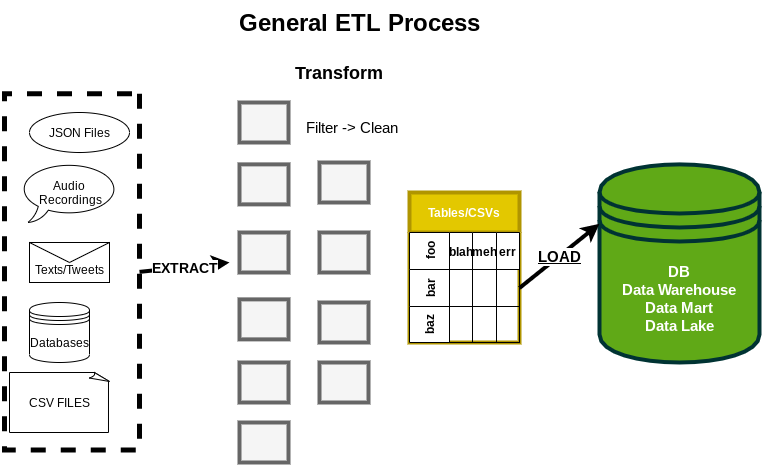

# Extract, Transform, and Load Processes

### Contents
1. [The ETL Process](#The_ETL_Process)
2. [Extracting](#Extracting)
3. [Transforming](#Transforming)
4. [Loading](#Loading)
5. [Data Warehouse or Database](#Data_Warehouse_or_Database)
    - [Batch Operations](#Batch_operations)
    - [ELT](#ELT)
  
## The ETL Process

ETL is the common abbriveation of the process which **extracts** raw information from various sources, then cleans or **transforms** this information into data which is able to be analyzed (or at least a single file format) and **loads** it into a single location (or at least a single cluster of locations) so it can be easily shared. 



Though this seems a simple definition with only a few steps, the reality must deal with the diversity and variety of data that needs to be transformed and loaded, the difficulty in transporting data when it comes in the massive quantities (Tb or Pb) it may need to transform, and how new technology can keep this process in flux as it must constantly adapt to changes in file formats and new ways of inputting information.

This section will provide some notes on how each step in this process works and how Big Data and new technology have changed it in recent years.

## Extracting

Data in the real-world rarely comes diectly in a nice CSV or JSON file. Instead, it is stored in many heterogeneous data sources (typically from multiple sources)
which must be processed and changed into a usable form (something we can transform). This is what we mean by ***Extract***: *that we must pull 
the data from these heterogeneous sources*. Sources which can include<sub>1</sub>:
  1. PDFs
    - Includng such things as PDFs of forms which include images of handwritten notes within them
  2. Human Readable Excel Spreadsheets (or Google Sheets or etc)
    - These are different then Well-Formatted Spreadsheets because they are not organized in a way that computers can easily read
  3. Proper (well formatted) or Improper XML (XML that doesn’t follow standard)
    - Or its cousin: HTML
  4. Images
  5. Sound Recordings (or direct mic input)
  6. JSON or CSVs or text files
  7. Full Databases
    - Its actually really common to have a number of individual (local) SQLite DBs that you merge into a single DB
  8. A host of other sources including IoT Devices
  
So a relitively simple extraction task may be to pull all the data from networked registers in the form of transcation 
"journals" (DBs or tables), user comments about their experiences (text files), user recording from the phone comment system,
and online sales files (jsons and full DBs). Then stage them for the "Transformation" process where we will validate, filter, 
and then clean up these to make it possible to load them into a single datastore.

## Transforming

This can easily be the **longest and most complicated stage** of the ETL process. It steps vary but all form of transformation aim to *change the raw information collected into usable (queriable or mathmatically calculatable) data*. As a secondary goal, though an important one when dealing with **Big Data**, the transforming stage also *aims at reducing the size of the files* to only the needed data to aid in data transmission. As pushing 2 Tb of raw information over 800 Gb of filtered data - yes, I've reduced data that much when dealing with audio and video files - is a huge performance boon. Though the steps vary, a general version would be:
   1. Filter data - ignore or don't use/pass to next function specific results typically we:
        - First: simply filter out (ignore) blank results (including empty spaces like *"     "* <- 5 spaces)
           - such as with Python: ```if not line.strip(): #do something``` 
           - in Java ```while ((line=in.readLine()) != null) { if (!line.trim().isEmpty()) { // do something }}```
           - If its an audio file or video file: using algorithms to find and ignore the static portions
        - Second: Remove invalid responses
           - meaning if comments are all lines with "#" as the first letter check and ignore these lines too
           - validate the data (ignoring 0s as invalid or maybe "A" as invalid when a number is expected)
           - in HTML or XML: ignoring tags we don't use or need (like the base \<xml\>\</xml\> tags)
           - other *"filter rules"* will vary based on data & data usage
   2. Clean data - Advance filtering: we ignored obviously bad data completly - now let's further remove:
       - I tend to log these for later checking as they many times denote problems or someone trying to hack the site
       - Remove any non-sensical results
           - Simple checking like: "workers present: 0" being removed because there cannot be a time there is no person in the office
           - String filtering which typically requires Natural Language Processing or, at least, regular expressions to find odd responses
               - It is also an advance concept which will not be covered much in this course
       - Enforce formats (change dates to needed format and type, round numbers or change decimal to ints, lowercase everything)
   3. Change data to useable data structure (load into json, csv, database, or etc. or even just load in a class or Dictionary)
        
 
Now these are not always ran seperately, in fact the terms ***data munging or data wrangling*** are commonly used to describe the process of extracting and cleaning data at the same time, but can be if data especially when data is pulled from numerious locations or comes in numerous forms where just loading the data for cleaning can be a process. Using the end example from our [extracting](#Extracting) section, the data is will need to be pulled from the various sources so various programs using different file commands, backend operations, automation, and network operations will be needed to just get the data staged for transformation. Then our transformation stage would need filter and clean this gathered data (repeating this process until it is complete) until a single database is output to be loaded into our main database. 

## Loading

This can be the simpliest stage or its own type of complication - it all depends on the data. The main goal is always to *load the data into a single datastore*. Now in our examples case, and in many cases, it could just be loading a database full of the days changes into our main DB. So just simple SELECTs, INSERTs, UPDATEs, and DELETEs queries until all the data is matching (with a backup ran before if your system is designed right). These are pretty standard backend or DBA tasks so in smaller applications not too difficult.

In large applications, the datastores used may be Data Warehouses, Data Marts, or Data Lakes and updating these is a seperate matter (and gets a whole section unto itself next). In even larger applications, the datastores used may be on multiple servers and require server level operations (and are covered in the Big Data sections).

Loading is where the database design is most tested, as a well-design database takes away from the complexity of nightly updates (even if its more work at the start). Whereas, a poorly designed (un-normalized) relational database tends to lead to more complicated queries, more errors, more table locking, data duplication (more memory usage), and make it much harder to diagnosis and fix errors. It is common to use this stage in ETL projects (when at early stages) to adjust the database design due to this.

## Data Warehouse or Database

ADD MODERN ELT PROCESS with DBW

#### ELT

<sub><sup>1: See *Beginning Database Design Solutions, Stephens,* Chapter 2: Database Types for more information on file types</sup></sub>
